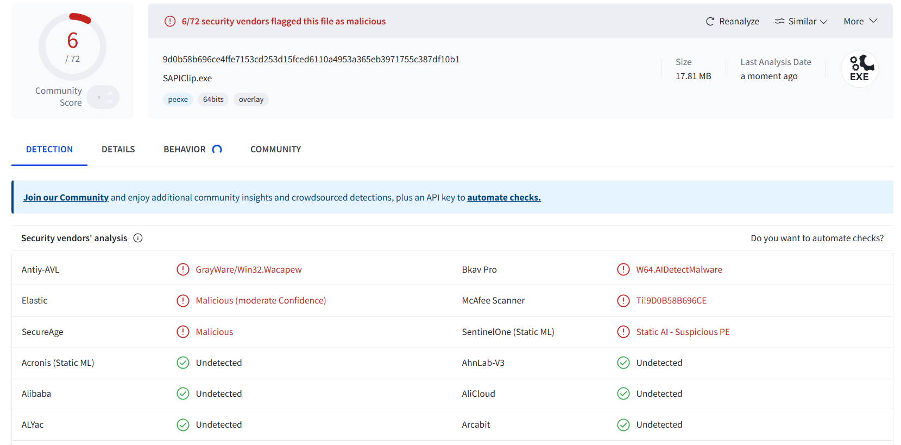

#  SAPIClip

Copyright (c) 2025 led-mirage

[Japanese](Readme.md)

## Overview

`SAPIClip` is a utility program for Windows that automatically reads aloud text copied to the clipboard. It features multilingual speech synthesis utilizing SAPI5 and includes automatic language detection. This tool is perfect for enhancing efficiency in work and study.

## Sister Applications

| Application | Speech Synthesis Engine	| Engine Note |
|-|-|-|
| [VoivoClip](https://github.com/led-mirage/VoivoClip) | [VOICEVOX](https://voicevox.hiroshiba.jp/) | Requires separate installation (Free) |
| [CoeiroClip](https://github.com/led-mirage/CoeiroClip) | [COEIROINK](https://coeiroink.com/) | Requires separate installation (Free) |
| [AivoClip](https://github.com/led-mirage/AivoClip) | [A.I.Voice](https://aivoice.jp/) | Requires separate installation (Paid) |
| [SAPIClip](https://github.com/led-mirage/SAPIClip) | SAPI5 | Built into Windows (Free) |

## Demo

https://github.com/user-attachments/assets/c029f66b-f2df-4e5a-9b24-1d208fb0e03d

## Features
- **Automatic Clipboard Monitoring:** Automatically detects and starts reading aloud whenever new text is copied to the clipboard.
- **Multilingual Speech Synthesis:** Utilizes SAPI5 to automatically read aloud in various languages.
- **Voice Switching:** Easily switch between available voices (speakers) and select your preferred voice.
- **Automatic Language Detection:** By setting the speaker to Auto, it detects the language and uses the corresponding voice for synthesis.
- **Speech Speed Adjustment:** You can adjust the speaking speed, allowing you to change the speed of the speech to suit your preference.
- **Simple Interface:** The GUI is intuitive and compact, so it does not get in the way.
- **Replay Functionality:** Easily replay the last spoken content.

## Confirmed Working Environment

- Windows 11 Pro 24H2
- Python 3.12.0

The application is expected to work on Windows 10 and Windows Home editions as well, although these environments have not been explicitly tested.

## How to Run

### 🛩️ Using the Executable (EXE)

#### 1. Create a Project Folder

Create a folder at a location of your choice for the project.

#### 2. Download the Application

Download the SAPIClip.ZIP from the link below and extract it to the folder you created.

https://github.com/led-mirage/SAPIClip/releases/tag/v0.1.0

#### 3. Execute

Double-click on SAPIClip.exe to launch the application.

### 🛩️ Running with Python

#### 1. Create a Project Folder

Create a folder at a location of your choice for the project.

#### 2. Launch the Terminal

Open the terminal or command prompt and navigate to the project folder you created.

#### 3. Download the Source Files

Download the ZIP file and extract it to the folder you created.
Alternatively, if you have Git installed, you can clone the repository using the following command:

```bash
git clone https://github.com/led-mirage/SAPIClip.git
```

#### 4. Install Libraries

Run the following command to install the necessary libraries:

```bash
pip install -r requirements.txt
```

#### 5. Execute

Run the following command to launch the application:

``` bash
python src\application.py
```

## Configuration

### ⚙️ Application Configuration File

The settings.json file contains the configuration information for this application.

Note: You can switch the configuration file by passing its name as a program argument.
Example: SAPIClip --setting my_settings.json

#### ✨ voice (Default: Auto)

Specify the name of the voice to use. When set to Auto, the application automatically selects and uses the appropriate voice for the text being read.

#### ✨ speed (Default: 1.2)

Sets the speed of the speech. This can be adjusted through the application's GUI.

#### ✨ replacements (Default: [])

Defines text replacement settings for reading aloud. Specify the target (pattern) with a regular expression and the replacement string with a normal string.

For example, to remove text within parentheses and URLs from speech, configure as follows. Multiple replacement patterns can be specified and are processed in order.

```json
    "replacements": [
        {
            "pattern": "\\(.*?\\)|（.*?）",
            "replacement": ""
        },
        {
            "pattern": "https?:\\/\\/(?:[\\w\\-\\.]+)+(?:[\\w\\.\\/\\?%&=]*)?",
            "replacement": ""
        }
    ]
```

#### ✨ preferred_voices (Default: See below)

Specifies preferred voice names for languages when the voice is set to Auto. In the default settings below, Microsoft Zira is used for English text and Microsoft Haruka for Japanese text.

If no voice is installed for the detected language, the first available voice specified here is used. For instance, if the text is in French and no French voice is available, it will attempt to use Microsoft Zira.

```json
    "preferred_voices": {
        "en": [
            "Microsoft Zira Desktop"
        ],
        "ja": [
            "Microsoft Haruka"
        ]
    }
```

## Adding Voices

Here's how to add voices in Windows 11.

1. Open Windows Settings and navigate to `Time & Language` - `Speech`.
2. Click the `Add voices` button under Manage Voices and select the language you want to install.

**Note:** After clicking the add button, changes won't be reflected immediately. There's no progress indicator during installation which might make you anxious, but just wait for a while and it will complete. The interface is a bit unfriendly in this regard.

## Notice

### ⚡ Antivirus Software False Positives

The executable file (SAPIClip.exe) for this program is created using a library called PyInstaller, but it may sometimes be falsely identified as malware by antivirus software.

Rest assured, there are no malicious elements in this application. For those concerned, please run the program using the method described above under "Running with Python."

We apologize for any inconvenience caused by these false detections and are actively seeking a solution, though we have yet to find a definitive one.

The check [results](https://www.virustotal.com/gui/file/9d0b58b696ce4ffe7153cd253d15fced6110a4953a365eb3971755c387df10b1) on VirusTotal are as follows (2025/01/31 v0.1.0)  
SAPIClip.exe ... Detected by 6 out of 72 antivirus engines



## Libraries Used

### 🔖 requests 2.32.3

Homepage: https://requests.readthedocs.io/en/latest/  
License: [Apache License 2.0](https://github.com/psf/requests/blob/main/LICENSE) 

### 🔖 pyperclip 1.9.0 

Homepage: https://github.com/asweigart/pyperclip/tree/master  
License: [BSD 3-Clause "New" or "Revised" License](https://github.com/asweigart/pyperclip/blob/master/LICENSE.txt)

### 🔖 Pillow 11.1.0

Homepage: https://github.com/python-pillow/Pillow  
License: [MIT-CMU License](https://github.com/python-pillow/Pillow/blob/main/LICENSE)

### 🔖 langdetect 1.0.9

Homepage: https://github.com/Mimino666/langdetect  
License: [Apache License 2.0](https://github.com/Mimino666/langdetect/blob/master/LICENSE)

### 🔖 pywin32 308

Homepage: https://github.com/mhammond/pywin32  
License: [PSF-2.0 license](https://spdx.org/licenses/PSF-2.0.html)

## License

© 2025 led-mirage

This application is released under the [MIT License](https://opensource.org/licenses/MIT). For more details, please refer to the LICENSE file included in the project.

## Version History

### 0.1.0 (2025/02/01)

- Initial release
